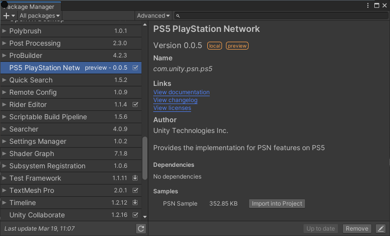

# PSN Sample

## Installation

1) Create a new Unity project and install the package, see [Installation](Installation.md)) for details.

2) Install the __PSN Sample__ from the package manager window by clicking the __Import into project__ button.

   

3) Switch build settings to PS5

4) To setup the project settings select the two menu options in (menu: __SCE Publishing Utils__)

   

   * __Set Publish Settings for PS5__ will update the publishing settings section (in the __Player Settings__). This will include a link to the samples __param.json__ file and PlayStation Network package metadata file __npconfig.zip__

   * __Set Input Manager__ will update the input system will a gamepad layout compatible with the PS5. Without this the sample app won't be able to recieve input from multiplay player gamepads. 

5) Open the __PSNSample__ Unity scene located in __Assets/Samples/PS5 PlayStation Network/*version*/PSN Sample/__} 
   
   The *version* number will depend on the package version.

6) Add the scene to the __Scenes In Build__ list, as scene 0, and build the project.

 

