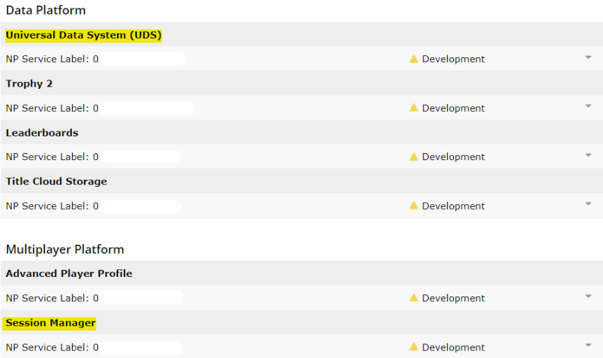
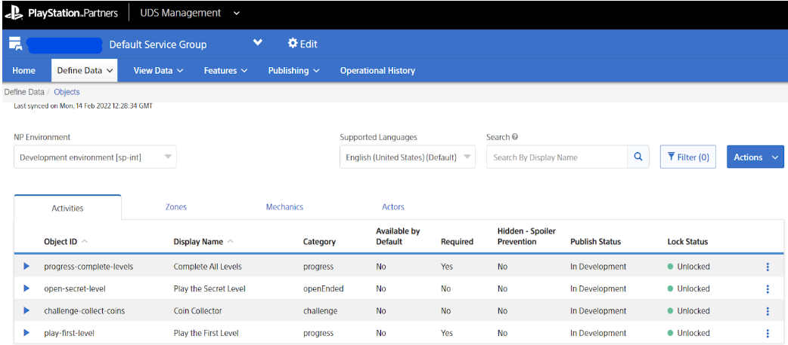

# Set up and configure your Activities

To create your own Activities for use in your PS5 game, you need a [PS5 Title](https://p.siedev.net/titles) with the UDS service enabled.

For Competitive Activities, the Session Manager service is also required. For information about the multiplayer platform and Session Manager, see [Multiplayer Platform](https://p.siedev.net/resources/documents/SDK/4.000/PSN_Multiplayer_Platform_Concept-Overview/multiplayer-platform.html) on DevNet.

Once you have a PS5 title with the required services, you can use the [UDS Management Tool](https://tools.partners.playstation.net/uds/app/uds-management/dashboard?sid=26&pid=psn) to define and manage Activities. Activities are classed as ‘Objects’ in UDS, so to create Activities go to ‘Define Data’ > ‘Objects’.

To interact with the Activities you create, you also need to declare UDS events under ‘Define Data’ > ‘Events’. This includes [system events](https://p.siedev.net/resources/documents/SDK/5.000/UniversalDataSystem-Overview/0003.html) declared by Sony, such as ‘activityStart’ and ‘activityEnd’, and custom events you create for UDS.

For instructions on using the UDS Management Tool, refer to the [UDS Management Tool User’s Guide](https://p.siedev.net/resources/documents/SDK/latest/UniversalDataSystem_Management_Tool-Users_Guide/__toc.html). 