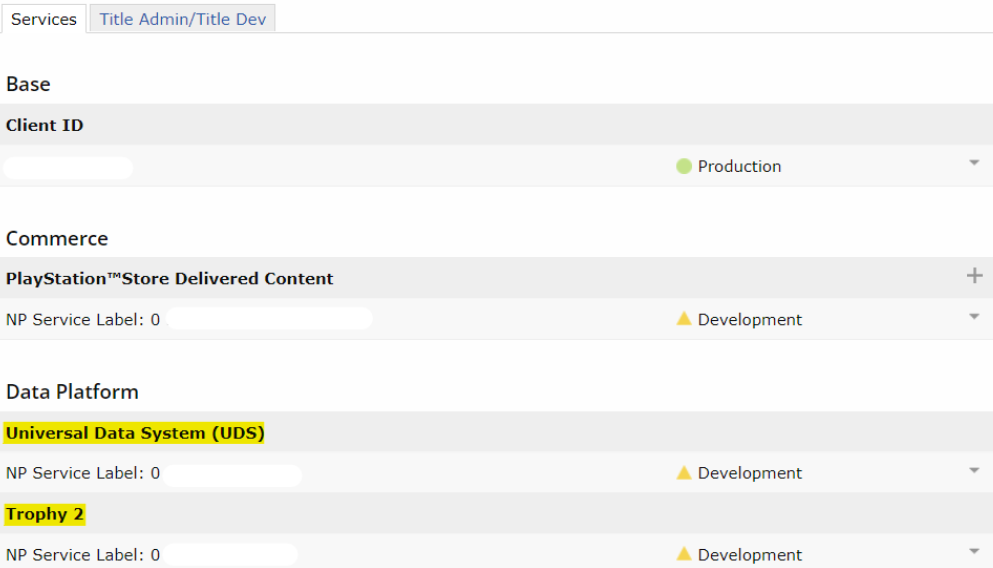
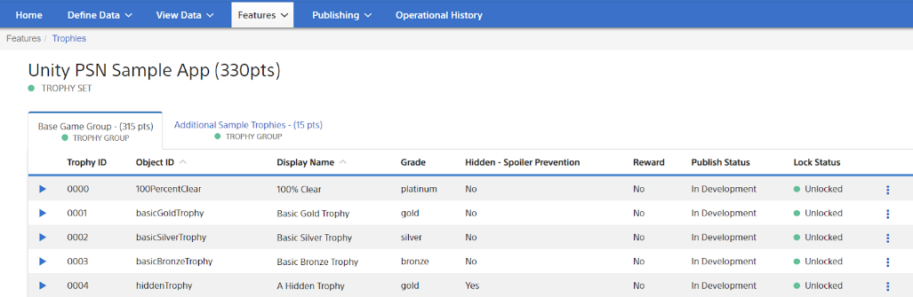

# Set up and configure Trophies

To use your own Trophies, you must add the **Universal Data System (UDS)** and **Trophy 2** services to your PS5 game and set up your Trophy data. For more information about requesting services, see [Making a Service Request](https://p.siedev.net/resources/documents/SDK/4.000/PSN_Service_Setup-Guide/0003.html) for PS5 on DevNet. 

After you add the UDS and Trophy 2 services to your PS5 product, you must configure your own Trophies using the [UDS Management Tool](https://tools.partners.playstation.net/uds/app/uds-management/dashboard?sid=26&pid=psn). 

You can use the UDS management tool to define each Trophy's metadata (for example, its name and image) and the relevant UDS Stat referenced by the Trophy’s unlocking condition. For instructions about using the UDS Management Tool, refer to the [UDS Management Tool User’s Guide](https://p.siedev.net/resources/documents/SDK/latest/UniversalDataSystem_Management_Tool-Users_Guide/__toc.html).

When you configure Trophies in the UDS Management Tool, UDS events will automatically be declared by the tool:

‘_UnlockTrophy’, an event for unlocking Binary Trophies
‘_UpdateTrophyProgress’, an event for showing the progress in Progressive Trophies

Progressive Trophies can also be tied to custom UDS Stats and UDS Events. 

For example, if you wanted to create the Trophies ‘Collect 10 Coins’ and ‘Collect 100 Coins’, this could be managed by creating a UDS Event ‘updateCoins’ that sends an integer representing the user’s current coins collected. You can then create a UDS Stat ‘coinsCollected’ which stores the value provided by the UDS Event. Trophies can then be created that depend on this Stat.

Once the Stat value exceeds the Trophy’s ‘target value’ (in this case, 10 and 100 for each respective Trophy), UDS will automatically unlock the Trophy for the user.

## Additional Resources

* To create Trophy configuration data, see [Creating Trophy Configuration Data](https://p.siedev.net/resources/documents/SDK/5.000/Trophy_System-Overview/0007.html) on DevNet.

* To configure Trophy unlocking conditions, refer to the “[Quick Configuration](https://p.siedev.net/resources/documents/SDK/5.000/Trophy_System-Overview/0002.html#:~:text=following%20two%20methods%3A-,Quick%20Configuration,-The%20quick%20configuration)” and “[Unlocking Trophies](https://p.siedev.net/resources/documents/SDK/5.000/Trophy_System-Overview/0002.html#:~:text=data%2C%20for%20example.-,Unlocking%20Trophies,-Use%20sceNpUniversalDataSystemPostEvent()%20to)” sections of [Game Play and the Trophy System](https://p.siedev.net/resources/documents/SDK/5.000/Trophy_System-Overview/0002.html) on DevNet.

* For information about Trophy attributes, see [Trophy Set Configuration](https://p.siedev.net/resources/documents/SDK/latest/Trophy_System-Overview/0003.html#__document_toc_00000008) on DevNet.