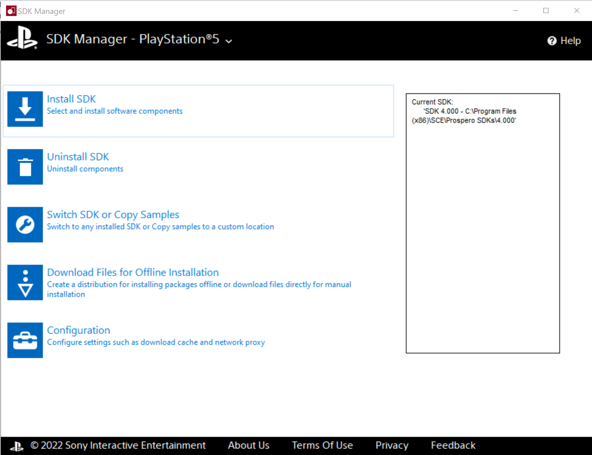
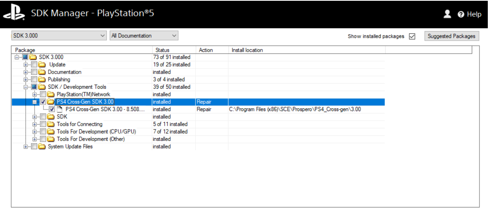
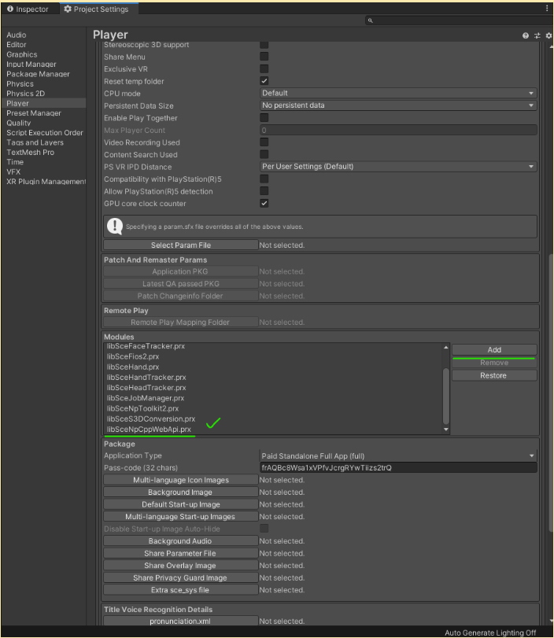

# Set up the PS4 Cross-Gen SDK

The following steps show you how to download and set up the PlayStation 4 (PS4) Cross-Gen SDK.

### Choose SDK versions

To enable cross-generational features in your PS4 game, you must use compatible versions of the PS4 and PlayStation 5 (PS5) SDKs in your Unity builds for each platform. Using compatible versions of the PS4 and PS5 SDKs allows you to make two builds from one Unity project; a PS4 application that uses the PS5 PlayStation Network, and a PS5 application that uses the PS5 PlayStation Network.

To choose compatible SDKs for your PS4 and PS5 builds, compare the SDK version numbers:

* PS4 SDK **8.00** is compatible with PS5 SDK** 2.00**
* PS4 SDK **8.50** is compatible with PS5 SDK **3.00**
* PS4 SDK **9.00** is compatible with PS5 SDK **4.00**
* PS4 SDK **9.50 **is compatible with PS5 SDK **5.00**

**Note: **Each PS4 SDK version is compatible with the PS5 SDK released at the same time. However, the version numbers do not match.

### Install SDKs

Download the relevant SDKs you require for your project via the SDK manager and check that they have installed (and are targeted) using the SDK manager.

To install the PS5 SDK, do the following:
1. Open the SDK Manager.
2. Choose PlayStation 5 from the dropdown menu.
3. Select ‘Install SDK’.
4. Choose the relevant SDK you want to install.
5. To add the Cross-Gen SDK, find the PS4 Cross-Gen SDK folder inside the SDK / Development Tools folder and ensure that the Cross-Gen SDK box is checked. This box is not checked by default. See the following screenshot for reference.   **Note:** If you have already installed the PS5 SDK, you can re-run the installation process for the SDK and select the checkbox to add it to your existing installation.
6. Run the installation.

If you do not have the PS4 SDK installed, do the following:

1. Open the SDK manager.
2. Choose PlayStation 4 from the dropdown menu.
3. Select ‘Install SDK’.
4. Choose the relevant SDK you want to install.
5. Run the installation.

**Note:** The PS4 Cross-Gen SDK files are available only as part of the PS5 SDK, therefore, only PS5 developers can use them on PS4.

### Unzip PS4 Cross-Gen SDK

The PS4 Cross-Gen SDK folder is stored in your program files and contains a .zip file with ‘-cross_gen.zip’ at the end of the file’s name. The .zip file contains extra files to add to your PS4 SDK installation. You cannot unzip it while it lives in the ``Program Files`` folder. Therefore, you must relocate the .zip file before extracting it and moving the required files to the PS4 SDK target folder.

 

The following steps outline the process for extracting the PS4 Cross-Gen SDK .zip file..

1. Locate where the PS4 Cross-Gen SDK folder is and find the .zip file.  For example, the install for the PS5 SDK 3.00 places the .zip file in `C:\Program Files (x86)\SCE\Prospero\PS4_Cross-gen\3.00`. For other versions of the SDK, the folder name `\3.00` changes to reflect the version number, for example, `\4.00`. 
2. Relocate the file to a different folder and extract it. It does not matter where it is extracted as long as it is no longer in the Program Files folder and you can remember where it is.
3. In the extracted folder, navigate to the `sdk/target/`folder.` The `sdk/target/` folder contains the following folders:   - Include   - Lib   - Samples   - Sce_module   - sce_module_symbol
4. Copy the above folders and their contents, and paste them to the relevant PS4 SDK’s target folder. The default location for this folder is `C:\Program Files (x86)\SCE\ORBIS SDKs\8.500\target`.

### Add PS5 module to PS4 Player

After you have installed the SDKs on your local computer, you need to add a PS5 module to your PS4 Player Settings to use the Cross-Gen SDK in your PS4 build.

1. Open the Player settings window (**Edit** > **Project Settings** > **Player**).
2. Expand the Publishing Setting section for the PS4 build target.
3. In the Modules section, select **Add**
4. Find and select the `libSceNpCppWebApi.prx` module (the default location for this module is C:\Program Files (x86)\SCE\ORBIS SDKs<YOUR SDK VERSION>\target\sce_module)

### Test Installation

If everything is set up correctly, you should now be able to initialize the PS5 PlayStation Network package by calling `Unity.PSN.PS5.Main.Initialize()` when running the build on a PS4. See [Access the PlayStation Network](AccessThePSNPackage.md) for more information about initializing the package.

If it is successful, you’ll see no error messages on the console output (on screen if you’re in development mode).

If it is unsuccessful, you’ll see an error message like `Exception During PS5 Initialization : Error loading SCE_SYSMODULE_NP_CPP_WEB_API (Sce : 0x80020002 ) ( PSNCore\Source\CoreMain.cpp.`If this appears, you will need to restart the SDK installation process.

The [Sony Cross-Generation SDK documentation](https://p.siedev.net/resources/documents/SDK/5.000/Cross_Generation-Overview/__toc.html) contains a list of supplements for each PlayStation Network library, which provides more information on any restrictions or considerations when using these libraries in a PS4 application.

