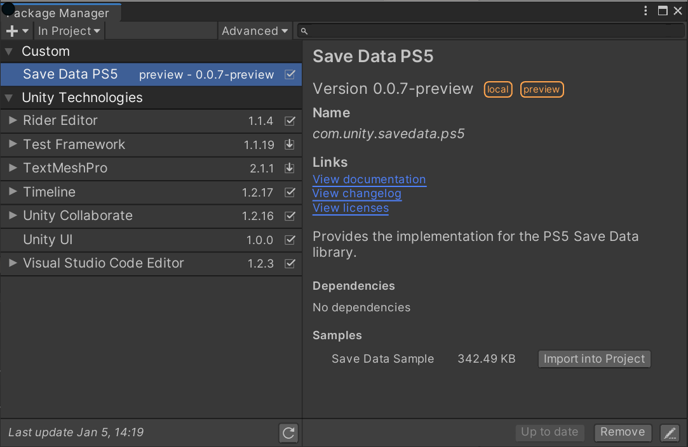
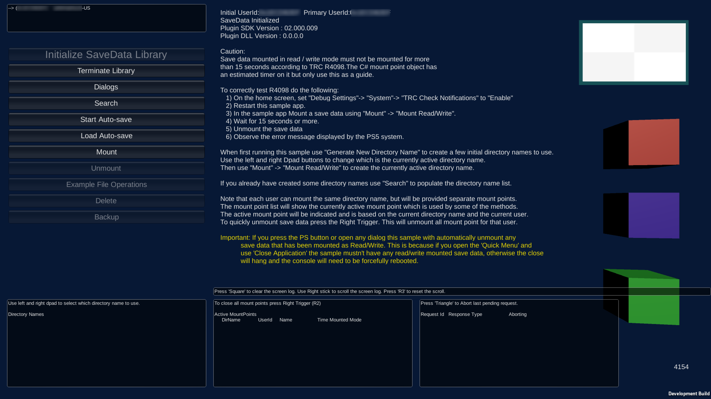

# Save Data Sample

## Installation

To install the sample, follow these steps:

1. Create a new Unity project and install the package. For more information, see the [Installation](Installation.md) page.

2. Install the __Save Data Sample__ from the Package Manager window (menu: **Window &gt; Package Manager**). Click the __Import into project__ button next to the sample.

   

3. Change your build target to PS5. Open the Build Settings window (menu: **File &gt; Build Settings**), select the PS5 build target, and click the **Switch Platform** button.

4. Configure settings for the project from the __SCE Publishing Utils__ menu. The sample adds this menu to Unity's top menu bar. You can configure the following settings:
   * __Set Publish Settings for PS5__ updates the **Publishing Settings** section in the __Player Settings__ window. 
   * __Set Input Manager__ updates the input system will a gamepad layout compatible with the PS5. Without this the sample, your title can't receive input from multiple player gamepads.

5. Open the __SaveSample__ Unity scene located in `Assets/Samples/Save Data PS5/(version)/Save Data Sample/` 
   
   The `(version)` number depends on the package version.

6) Add the scene to the __Scenes In Build__ list, as scene 0, and build the project.

## Sample Title

The sample title demonstrates the various features for the Save Data package.

 
You can test each of the features, such as searching, mounting (including creating), and file operations for save data. 

You can also see how the save, load and delete save data dialog sequence appears. 

The sample supports multiple users. If multiple gamepads are connected to the PS5, the user IDs display in the top-left of the screen. The active user is based on the last gamepad that received input. This allows the various save data features to be tested with different users as each user has their own set of save data. 

The project script code for the sample is located in `Assets/Samples/Save Data PS5/(version)/Save Data Sample/SonyExamples` after you import the sample.
